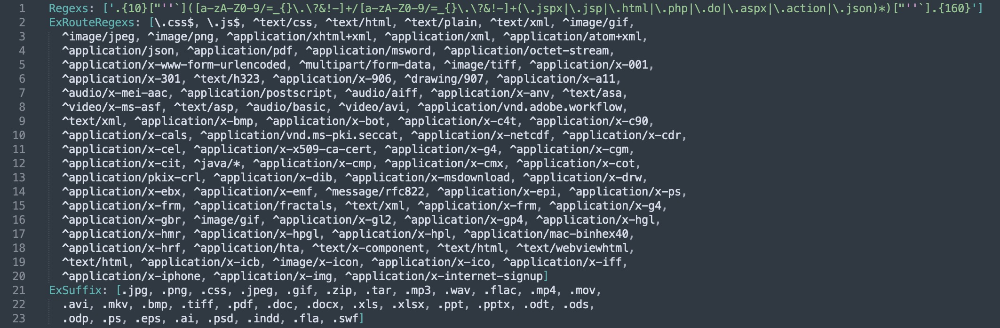
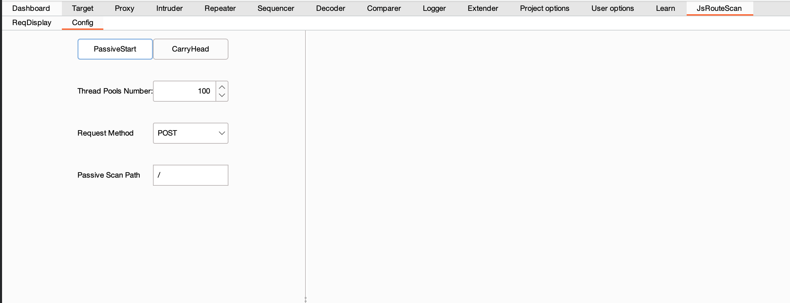
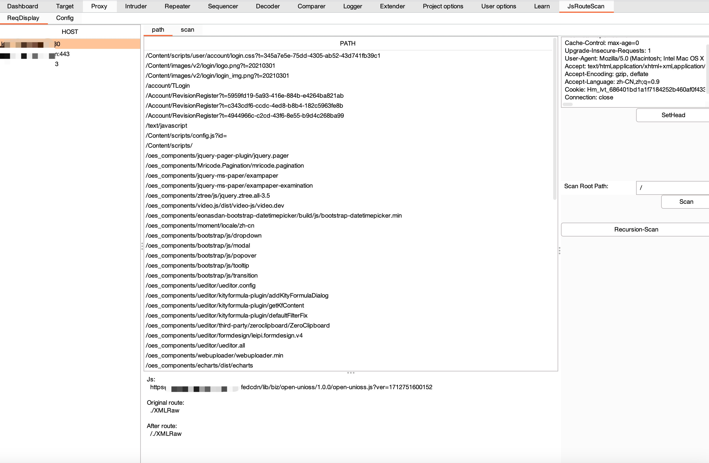
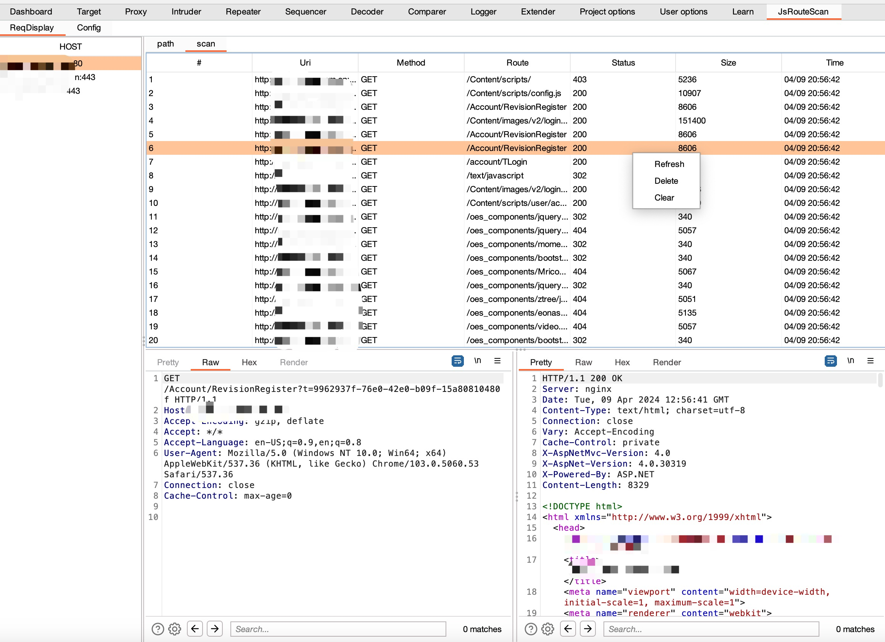

# JsRouteScan
Burpsuite - Js Route Scan 正则匹配获取响应中的路由进行探测或递归目录探测的burp插件

***

## 感谢

* 参考项目 [yitaiqiFilterJs](https://github.com/fKzhangsa/FilterJs)

## 介绍

JsRouteScan是使用java语言根据burpsuite api编写的burpsuite插件。

插件通过被动扫描的方式，根据指定正则列表在响应包中匹配疑似路由的字符串，然后可以根据设定，被动探测根目录或者其他目录。也提供了将匹配到的路由作为payload，递归探测当前网站所有路径中的每一层路径。

## 功能介绍

装载插件：``` Extender - Extensions - Add - Select File - Next ```

初次装载插件会在```用户目录/.config/JsRouteScan/```目录下生成config.yaml文件，其中包含了 

* Regexs（在响应中匹配路由的正则表达式列表）
* ExRouteRegexs（在响应中排除路由的正则表达式列表）
* ExSuffix（排除匹配相应的后缀列表，符合列表中后缀的请求将不会在响应中匹配路由）



Config面板用来设置插件中被动探测的一些配置，此面板中的配置会应用到所有匹配的网站中。

* PassiveStart按钮：被动探测启动按钮，开启后所有匹配到的路由都会以Passive Scan Path中的值作为根目录来请求。
* CarryHead按钮：携带请求头按钮，开启后所有由插件发起的请求均会携带原始请求头。（此请求头为第一次获取到路由的请求头）
* Thread Pools Number：线程池的线程数
* Request Method：请求的方式，包含GET与POST
* Passive Scan Path：被动探测的根目录，默认为/



ReqDisplay面板用来存储获取到路由的网站host头，与当前网站获取的路由，以及当前网站的扫描结果。

右边的配置只会对当前网站起效。

* Scan Root Path：主动扫描的根目录
* Scan按钮：点击后会获取PATH中的所有路由，对当前网站发起扫描，根目录为Scan Root Path的值
* Recursion-Scan按钮：递归扫描，点击后会获取PATH中的所有路由，然后递归对当前网站的每一层路径进行扫描



scan面板用来展示请求的内容以及扫描的内容，此面板不会自动更新，需要右键Refresh



## 提示

​	Recursion-Scan功能一定要注意PATH中的路由数量，没用的删一删再扫，递归扫描的请求数量是根据目录层级而指数级增长的哦。
## 更新计划
* 自定义head头
* 配置文件在线更新？

## 开心值

[

## 最后
如有匹配正则、BUG、需求等欢迎提Issues

